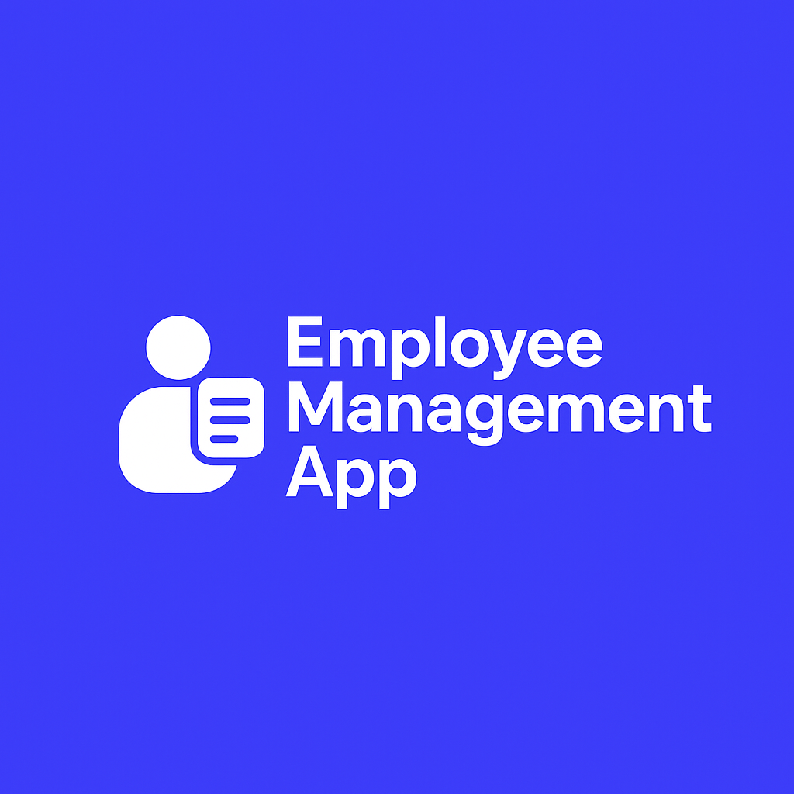
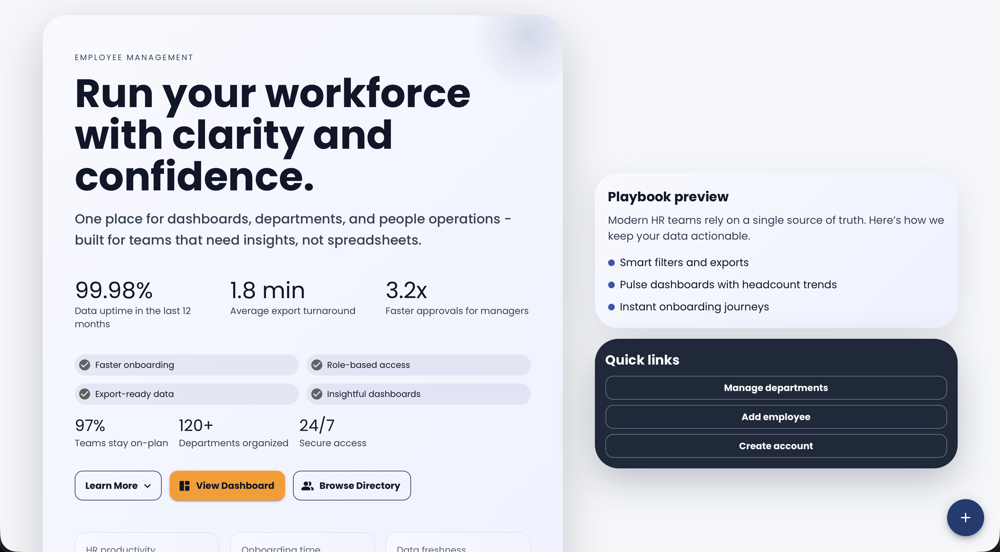
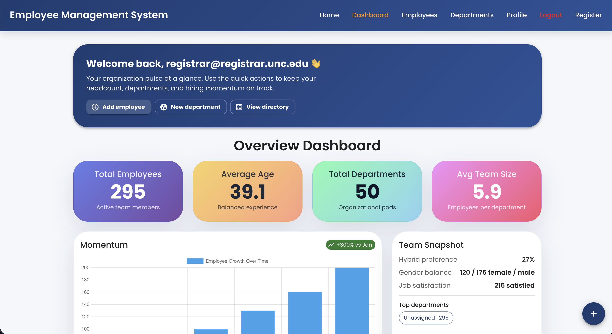
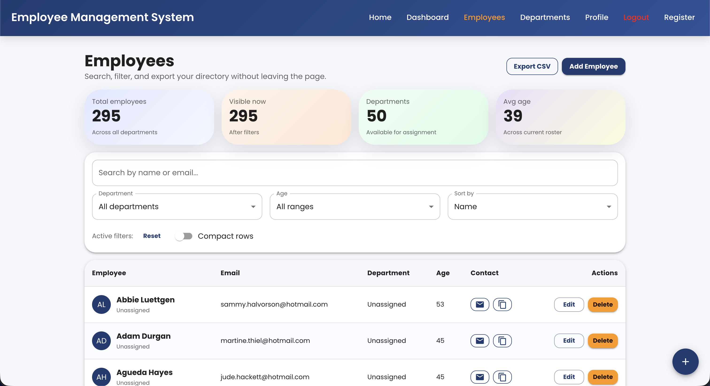
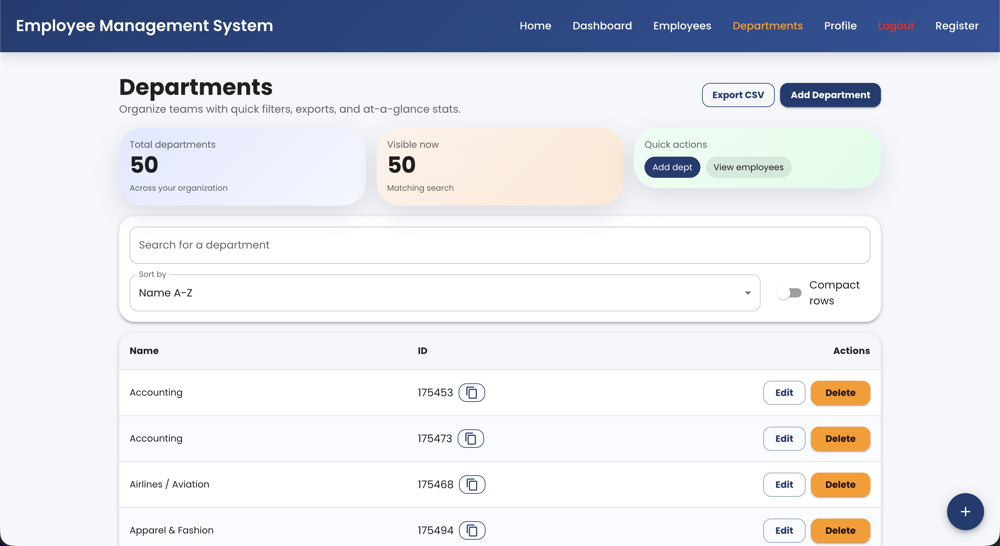
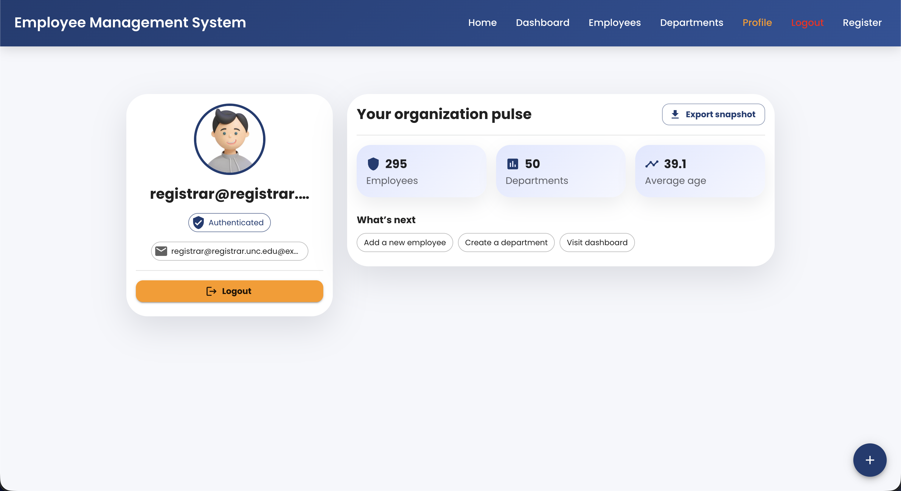
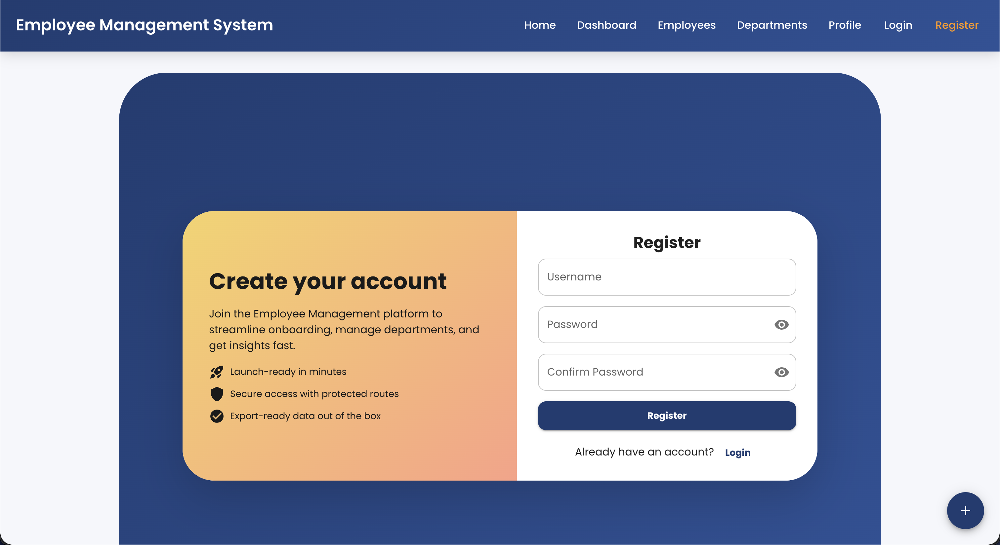
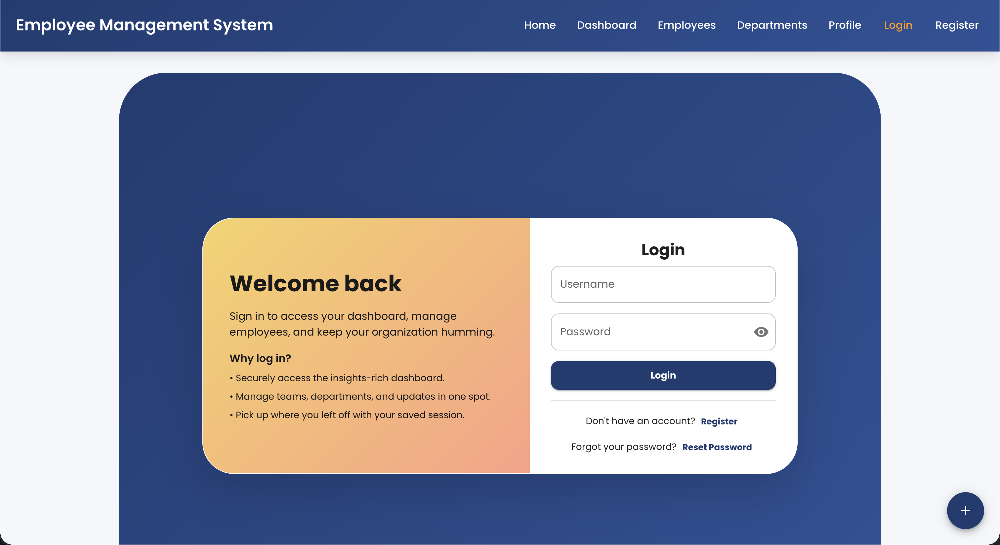

# Employee Management Full-Stack Application

The **Employee Management Full-Stack Application** is a modern, feature-rich system for managing employee and department data using a React frontend and Spring Boot backend.

Designed for scalability and maintainability, this project demonstrates full-stack architecture, containerization, and CI/CD concepts.

<p align="center">
  
</p>

---

## Overview

This project integrates:

- React (Frontend)
- Spring Boot (Backend)
- MySQL (Database)

Key capabilities:

- Employee & Department CRUD
- REST API integration
- Dashboard with charts
- Layered backend architecture

---

## Architecture at a Glance

- React SPA communicates with Spring Boot APIs via Axios
- Backend follows Controller → Service → Repository pattern
- MySQL used for structured storage

---

## User Interface

<p align="center">
  
</p>

<p align="center">
  
</p>

<p align="center">
  
</p>

<p align="center">
  
</p>

<p align="center">
  
</p>

<p align="center">
  
</p>

<p align="center">
  
</p>

---

## API Endpoints

| Endpoint | Method | Description |
|--------|--------|------------|
| /api/employees | GET | Get all employees |
| /api/employees/{id} | GET | Get employee |
| /api/employees | POST | Create employee |
| /api/employees/{id} | PUT | Update employee |
| /api/employees/{id} | DELETE | Delete employee |
| /api/departments | GET | Get departments |
| /api/departments/{id} | GET | Get department |
| /api/departments | POST | Create department |
| /api/departments/{id} | PUT | Update department |
| /api/departments/{id} | DELETE | Delete department |

---

## Backend Setup

```bash
git clone https://github.com/nithishdurnala-19/Employee-Management-Fullstack-App.git
cd Employee-Management-Fullstack-App/backend
mvn install
mvn spring-boot:run
```

Backend runs at:
http://localhost:8080

---

## Frontend Setup

```bash
cd frontend
npm install
npm start
```

Frontend runs at:
http://localhost:3000

---

## Containerization

```bash
docker compose up --build
```

---

## Kubernetes

```bash
kubectl apply -f kubernetes/
```

---

## Jenkins

Pipeline includes:

- Build
- Test
- Docker image build
- Deployment

---

## Troubleshooting

Backend:

```bash
mvn clean install
```

Frontend:

```bash
npm install
npm start
```

---

## License

MIT License

---

## Author

**Nithish Durnala**
